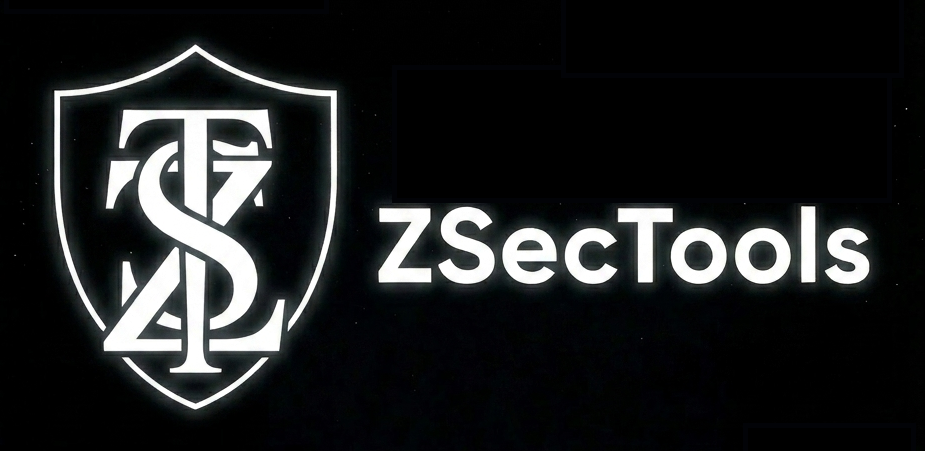

<div align="center">
  
</div>

# ZSecTools

> An open-source collection of security, SOD analysis, and mass administration tools for SAP systems.

## Table of Contents

- [About](#about)
- [Disclaimer](#disclaimer)
- [Prerequisites](#prerequisites)
- [Configuration](#configuration)
- [SAP Technical User](#sap-technical-user)
- [Installation](#installation)
  - [Windows](#windows)
  - [Docker / Linux](#docker--linux)
- [Running the Application](#running-the-application)
- [Project Structure](#project-structure)
- [Known Issues / Missing Features](#known-issues--missing-features)
- [SOD Analysis Accuracy](#sod-analysis-accuracy)
- [User Guide](#user-guide)
- [Contributing](#contributing)
- [License](#license)

## About

ZSecTools is a browser-based application for SAP security administration and Segregation of Duties (SOD) analysis. It connects to one or more SAP systems via RFC, lets you import and manage authorization-related data, run mass administration tasks (such as batch RFC execution for users and roles), and perform SOD risk analysis against a configurable rule matrix.

The tool was originally developed for personal use to support day-to-day SAP security administration and SOD analysis work. It is now shared as open source in the hope that it can be useful to others facing similar needs. Contributions, bug reports, and suggestions are very welcome.

## Disclaimer

SAP and SAP NetWeaver are trademarks or registered trademarks of SAP SE in Germany and in several other countries. This project is an independent open-source tool and is not affiliated with, sponsored, or endorsed by SAP SE.

## Prerequisites

To use ZSecTools, you need to provide the official SAP connectivity libraries, which are **not included** in this repository due to SAP licensing restrictions.

- **SAP NW RFC SDK**: download the latest version of the SAP NW RFC SDK from the [SAP ONE Support Launchpad](https://me.sap.com/swdcnav) (requires a valid SAP S-User account).

  If the link above is unavailable, please visit the [SAP support page directly](https://support.sap.com/en/product/connectors/nwrfcsdk.html).

- **Installation**: place the library files (`sapnwrfc.dll` / `.so`) in a folder on the host machine and set `SAPNWRFC_HOST_PATH` accordingly in your `.env` file (see [Configuration](#configuration)).
> **Note**: you can also save the SDK path from the app's **Health Checks** panel so it can be applied automatically on backend startup, but tihs works for Windows and Linux only. On Docker the volume  with library files must be mounted, so please mantain your `.env` file in this case.

## Configuration

ZSecTools uses a single `.env` file in the project root for all environment-specific settings. This file is read automatically both by Docker Compose (for container setup and volume mounts) and by the Node.js backend (via `dotenv`).

**Setup steps:**

1. Copy the provided template to create your local configuration file:

   ```bash
   cp .env.example .env
   ```

2. Open `.env` and fill in the values for your environment. The file is self-documented — each variable has an inline comment explaining what it does. The key values to set are:

   | Variable | Description |
   |---|---|
   | `SAPNWRFC_HOST_PATH` | Absolute path to the SAP NW RFC SDK folder **on the host machine** |
   | `SAPNWRFC_CONTAINER_PATH` | Path where the SDK will be mounted **inside the container** (default: same as host path) |
   | `SAPNWRFC_HOME` | Must match `SAPNWRFC_CONTAINER_PATH` |
   | `LD_LIBRARY_PATH` | Must be `<SAPNWRFC_CONTAINER_PATH>/lib` |
   | `DB_HOST` | Use `db` when running via Docker Compose; use `localhost` when running the backend directly outside Docker |

3. The `.env` file is listed in `.gitignore` and will never be committed. The template `.env.example` is committed in its place and should be kept up to date.

> **Note for Windows users**: when running via `run.bat` or the Windows services, the `.env` file is not loaded automatically by the batch scripts — environment variables are set directly inside those scripts. If you change a value in `.env`, also update the corresponding line in `run.bat` (or restart the services after editing `install-services.bat`).

## SAP Technical User

ZSecTools connects to SAP systems using a dedicated technical user, whose credentials are configured in the **SAP Realms** section of the application.

This technical user should be set up as follows:

- **User type**: `B` (System / Background)
- **Password**: strong and complex, following your organization's security policy
- **Authorization**: assign the role `ZSECTOOLS`, available as [`ZSECTOOLS.SAP`](./ZSECTOOLS.SAP) in the root of this repository. This file can be imported directly into SAP using transaction `SG3I` or equivalent. Alternatively, you can create a custom role with at least the authorizations contained in that file.

> **Note**: the `ZSECTOOLS.SAP` file is a SAP role export. It includes all the authorization objects and field values required for ZSecTools to read the necessary tables and execute the supported RFC calls. Please note that this role is strictly designed according to the **principle of least privilege**. Removing or restricting any of the included authorizations may cause the application to malfunction. Review the authorizations before importing them, and adjust them to your organization's security standards where appropriate.

## Installation

### Windows

Run the setup script:

```bat
setup.bat
```

This downloads portable, self-contained versions of **Node.js** and **PostgreSQL** and uses them to build the frontend, build the backend, and run the application — no system-wide installation of Node.js or PostgreSQL is required.

If you prefer to use your own locally installed versions of Node.js and PostgreSQL instead, edit the commands inside `setup.bat` (and `run.bat`) accordingly.

### Docker / Linux

1. Make sure you have completed the [Configuration](#configuration) steps above and that `.env` exists with `SAPNWRFC_HOST_PATH` pointing to a valid SAP SDK installation on the host.

2. Build and start the application:

   ```bash
   sudo docker compose up --build
   ```

> A native Linux setup is also provided (`setup.sh`, `run.sh`, `install-services.sh`), but these scripts have not been tested yet. Use the Docker approach for the most reliable experience on Linux for now.

## Running the Application

### Windows

```bat
run.bat
```

### Run as a Windows service (optional)

If you don't want to launch `run.bat` manually every time, you can install ZSecTools as two Windows services with automatic startup. Run the following command **with administrator rights**:

```bat
.\install-services.bat
```

In all cases (manual run, service, or Docker), the application is served on **`http://localhost:3000`**.

## Project Structure

- `frontend/`: browser UI (React + Vite)
- `backend/`: API and integration logic (Node.js + Express), including SAP RFC calls via `node-rfc`
- `docker-compose.yml`: local multi-service startup (frontend, backend, PostgreSQL)
- `.env.example`: environment variable template — copy to `.env` and fill in your values
- `setup.bat` / `run.bat` / `install-services.bat`: Windows setup, run, and service installation scripts
- `setup.sh` / `run.sh` / `install-services.sh`: untested Linux equivalents

## Known Issues / Missing Features

- **Translations are not parameterized**: the UI language is hard-coded to English.
- **Some useful UI elements are still missing**, e.g. a button to import SOD elements to be analyzed from a file.
- **The user interface is very basic**, with no theming support. Dark mode support is planned for a future release.
- **Environment variables and settings management is incomplete or inconsistent**, and is currently scattered across multiple files.
- **Some configuration details are not easily parameterizable**, for example the frontend port.
- **Windows needs App restart when SAP SDK path changed**, this is because of env variables handling in Windows.

## SOD Analysis Accuracy

ZSecTools is not an official SAP product, and its SOD analysis engine is not certified against any standard. Results should be considered **indicative** rather than authoritative. Personal testing has produced consistently correct results so far, but differences or bugs compared to dedicated commercial GRC/SOD products may still emerge. Always validate critical findings before relying on them for compliance or audit purposes.

## User Guide

See [`userguide.md`](./userguide.md) for a detailed walkthrough of every section of the application.

## Contributing

Contributions are welcome, whether in the form of bug reports, feature suggestions, documentation improvements, or pull requests.

## License

This project is released under a custom open-source license: the code is free to use, modify, and redistribute, on the condition that no fee is charged for its distribution, sale, or inclusion in commercial packages. Any redistribution must remain entirely free of charge. See [`LICENSE`](./LICENSE) for the full text.
